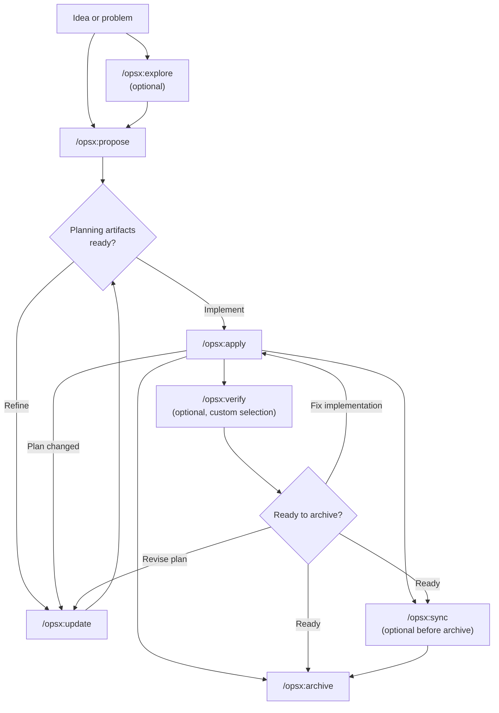
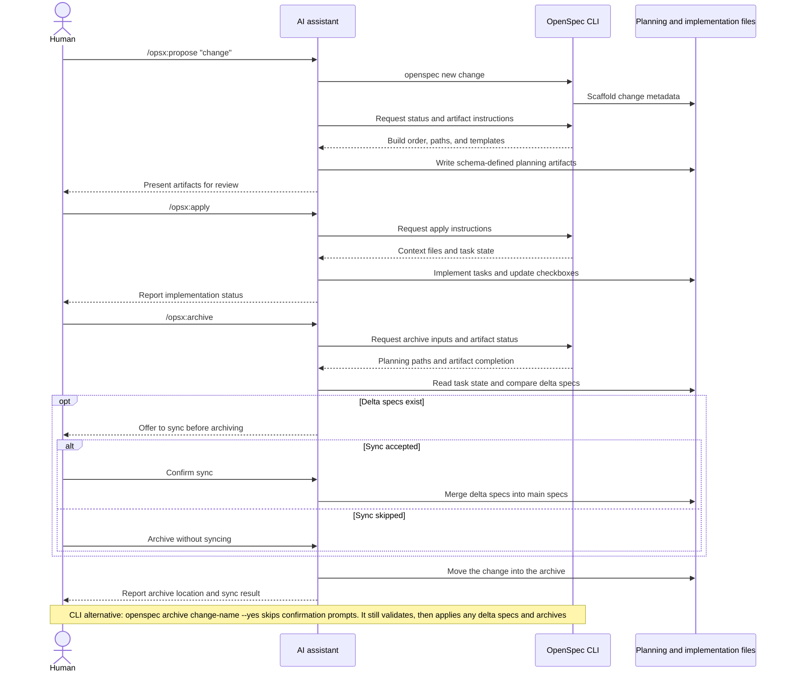

# 工作流

本指南涵盖 OpenSpec 的常见工作流模式，以及各自适用的场景。关于基本设置，请参阅 [Getting Started](getting-started.md)。关于命令参考，请参阅 [Commands](commands.md)。

## 理念：动作而非阶段

传统工作流强迫你走过各个阶段：先规划，再实现，然后就结束。但真实的工作并不能 neatly 地塞进一个个盒子里。

OPSX 采用了不同的思路：

```text
Traditional (phase-locked):

  PLANNING ────────► IMPLEMENTING ────────► DONE
      │                    │
      │   "Can't go back"  │
      └────────────────────┘

OPSX (fluid actions):

  proposal ──► specs ──► design ──► tasks ──► implement
```

**关键原则：**

- **动作而非阶段** - 命令是你可以做的事，而非把你卡住的某个阶段
- **依赖是促成者** - 它们表明什么是可能的，而非下一步必须做什么

> **定制：** OPSX 工作流由定义 artifact 序列的 schema 驱动。关于创建自定义 schema 的详情，请参阅 [Customization](customization.md)。

## 工作流一览

默认工作流保持流动：探索和验证是可选的，并且当实现暴露出新情况时，你可以随时更新规划 artifact。



AI 助手驱动工作流，而 CLI 提供确定性的脚手架、状态与 artifact 指令：



## 两种模式

### 默认快速路径（`core` 配置）

新安装默认使用 `core`，提供：
- `/opsx:explore`
- `/opsx:propose`
- `/opsx:apply`
- `/opsx:update`
- `/opsx:sync`
- `/opsx:archive`

典型流程：

```text
/opsx:explore ──► /opsx:propose ──► /opsx:apply ──► /opsx:sync ──► /opsx:archive
  (optional)
```

#### 从探索开始（值得养成的习惯）

`/opsx:explore` 是默认配置的一部分，而非高级附加项。每当你遇到问题、却还没有方案时——在有了 AI 助手之后，大多数时候都是如此——它就是该做的动作。

```text
You: /opsx:explore

AI:  What would you like to explore?

You: Our search results feel stale. I'm not sure if it's caching,
     indexing, or the query itself.

AI:  Let me look... [reads the search service and cache layer]
     It's the index: it only rebuilds nightly, so edits don't show
     up until the next day. Two options: rebuild on write (simple,
     more load) or a short-TTL cache invalidation (more moving parts,
     less load). Given your write volume is low, rebuild-on-write is
     the cleaner fix. Want to scope it?

You: Yes.

You: /opsx:propose rebuild-search-index-on-write
```

探索不创建任何 artifact，也不写任何代码。它是一场免费、零风险的对话，能把模糊的担忧变成精确的 change，于是随后的 proposal 才切中要害。已经确切知道想要什么了？跳过它，直接去 `/opsx:propose`。完整指南：[Explore First](explore.md)。

### 扩展/完整工作流（自定义选择）

如果你想要显式的脚手架与构建命令（`/opsx:new`、`/opsx:continue`、`/opsx:ff`、`/opsx:verify`、`/opsx:bulk-archive`、`/opsx:onboard`），用以下方式启用：

```bash
openspec config profile
openspec update
```

## 工作流模式（扩展模式）

### 快速功能

当你清楚要构建什么、只需要执行时：

```text
/opsx:new ──► /opsx:ff ──► /opsx:apply ──► /opsx:verify ──► /opsx:archive
```

**示例对话：**

```text
You: /opsx:new add-logout-button

AI:  Created openspec/changes/add-logout-button/
     Ready to create: proposal

You: /opsx:ff

AI:  Creating all planning artifacts...
     ✓ proposal.md
     ✓ specs/
     ✓ design.md
     ✓ tasks.md
     Ready for implementation!

You: /opsx:apply

AI:  Working through tasks...
     ✓ Added logout button to header
     ✓ Implemented session clearing
     ✓ Added confirmation dialog
     All tasks complete!

You: /opsx:archive

AI:  ✓ Merged specs
     ✓ Archived change
```

**最适合：** 中小型功能、缺陷修复、直白的变更。

### 探索式

当需求不清、或需要先行调研时：

```text
/opsx:explore ──► /opsx:new ──► /opsx:continue ──► ... ──► /opsx:apply
```

**示例对话：**

```text
You: /opsx:explore

AI:  What would you like to explore?

You: I want to improve page load performance but I'm not sure
     where the bottlenecks are.

AI:  Let me help investigate...
     [Analyzes bundle sizes, identifies slow queries, reviews
     component render patterns]

     I found three main bottlenecks:
     1. Large unoptimized images
     2. Synchronous data fetching in ProductList
     3. Re-renders from context changes

     Which would you like to address first?

You: Let's tackle the data fetching issue.

You: /opsx:new optimize-product-list-fetching

AI:  Created change. Ready to create: proposal

You: /opsx:continue

AI:  Creating proposal based on our exploration...
     [Writes proposal incorporating investigation insights]

     Ready to create: specs, design
     Which would you like next?

You: /opsx:continue

AI:  Creating specs...
```

**最适合：** 性能优化、调试、架构决策、需求不清。

### 并行变更

同时处理多个 change：

```text
Change A: /opsx:new ──► /opsx:ff ──► /opsx:apply (in progress)
                                         │
                                    context switch
                                         │
Change B: /opsx:new ──► /opsx:ff ──────► /opsx:apply
```

**示例对话：**

```text
You: I'm working on add-dark-mode but got pulled into a bug fix

You: /opsx:new fix-login-redirect

AI:  Created openspec/changes/fix-login-redirect/

You: /opsx:ff

AI:  ✓ Created planning artifacts

You: /opsx:apply

AI:  Working on fix-login-redirect...
     [Implements the fix]
     All tasks complete!

You: /opsx:archive

AI:  ✓ Archived fix-login-redirect

You: Let's get back to dark mode

You: /opsx:apply add-dark-mode

AI:  Resuming add-dark-mode...
     Picking up at task 2.3: Update Header...
```

**最适合：** 并行工作流、紧急打断、团队协作。

当你有多个已完成的 change 时，使用 `/opsx:bulk-archive`：

```text
You: /opsx:bulk-archive

AI:  Found 3 completed changes:
     - add-dark-mode (all tasks done)
     - fix-login-redirect (all tasks done)
     - update-footer (all tasks done)

     Checking for spec conflicts...
     ⚠ add-dark-mode and update-footer both touch specs/ui/

     Inspecting codebase to resolve...
     Both changes are implemented. Will apply in chronological order.

     Archive all 3 changes?

You: Yes

AI:  ✓ Archived add-dark-mode
     ✓ Archived fix-login-redirect
     ✓ Archived update-footer
     Specs merged in order: add-dark-mode → update-footer
```

批量归档会在多个 change 触及相同 specs 时进行检测，并通过检查实际已实现的内容来解决冲突。

### 完结一个 Change

推荐的完结流程：

```text
/opsx:apply ──► /opsx:verify ──► /opsx:archive
                    │                 │
              validates          prompts to sync
              implementation     if needed
```

#### Verify：检查你的工作

`/opsx:verify` 从三个维度校验实现是否匹配你的 artifact：

```text
You: /opsx:verify

AI:  Verifying add-auth...

     COMPLETENESS
     ✓ All 12 tasks in tasks.md are checked
     ✓ All requirements in specs have corresponding code
     ⚠ Scenario "Session timeout after inactivity" not tested

     CORRECTNESS
     ✓ Implementation matches spec intent
     ✓ Edge cases from scenarios are handled
     ✓ Error states match spec definitions

     COHERENCE
     ✓ Design decisions reflected in code structure
     ✓ Naming conventions consistent with design.md
     ⚠ Design mentions "event-driven" but implementation uses polling

     SUMMARY
     ─────────────────────────────
     Critical issues: 0
     Warnings: 2
     Ready to archive: Yes (with warnings)

     Recommendations:
     1. Add test for session timeout scenario
     2. Consider refactoring to event-driven as designed, or update design.md
```

**verify 检查的内容：**

| 维度 | 校验内容 |
|-----------|------------------|
| 完整性 | 所有 task 完成、所有 requirement 已实现、scenario 已覆盖 |
| 正确性 | 实现匹配 spec 意图、边界情况已处理 |
| 一致性 | 设计决策在代码中得到体现、模式保持一致 |

verify 不会阻止归档，但会暴露你可能想先处理的问题。

#### Archive：完结变更

`/opsx:archive` 完结该 change 并将其移动到 archive：

```text
You: /opsx:archive

AI:  Archiving add-auth...

     Artifact status:
     ✓ proposal.md exists
     ✓ specs/ exists
     ✓ design.md exists
     ✓ tasks.md exists (12/12 tasks complete)

     Delta specs: Not yet synced to main
     → Would you like to sync now?

You: Yes

AI:  ✓ Synced specs to openspec/specs/auth/spec.md
     ✓ Moved to openspec/changes/archive/2025-01-24-add-auth/

     Change archived successfully.
```

如果 specs 尚未同步，archive 会提示。它不会在未完成任务上阻断，但会警告你。

## 何时使用什么

### `/opsx:ff` 与 `/opsx:continue` 对比

| 情形 | 使用 |
|-----------|-----|
| 需求明确、准备好构建 | `/opsx:ff` |
| 正在探索、想逐步审查 | `/opsx:continue` |
| 想在 specs 之前先迭代 proposal | `/opsx:continue` |
| 时间紧迫、需要快速推进 | `/opsx:ff` |
| 复杂变更、想要掌控 | `/opsx:continue` |

**经验法则：** 如果你能提前描述完整范围，就用 `/opsx:ff`。如果你是一边做一边理清，就用 `/opsx:continue`。

### 何时更新，何时另起炉灶

一个常见的问题：何时更新一个已有的 change 是合适的，何时又该新建一个？

**在以下情况更新已有 change：**

- 意图相同，只是细化了执行
- 范围收窄（先交付 MVP，其余以后再说）
- 由学习驱动的纠正（代码库并非你所预期）
- 基于实现中的发现对设计做微调

**在以下情况新建 change：**

- 意图发生根本改变
- 范围爆炸式扩张，变成了完全不同的工作
- 原 change 可以独立标记为"完成"
- 打补丁比澄清更让人困惑

```text
                     ┌─────────────────────────────────────┐
                     │     Is this the same work?          │
                     └──────────────┬──────────────────────┘
                                    │
                 ┌──────────────────┼──────────────────┐
                 │                  │                  │
                 ▼                  ▼                  ▼
          Same intent?      >50% overlap?      Can original
          Same problem?     Same scope?        be "done" without
                 │                  │          these changes?
                 │                  │                  │
       ┌────────┴────────┐  ┌──────┴──────┐   ┌───────┴───────┐
       │                 │  │             │   │               │
      YES               NO YES           NO  NO              YES
       │                 │  │             │   │               │
       ▼                 ▼  ▼             ▼   ▼               ▼
    UPDATE            NEW  UPDATE       NEW  UPDATE          NEW
```

**示例："Add dark mode"**

- "还需要支持自定义主题" → 新建 change（范围爆炸）
- "系统偏好检测比预期更难" → 更新（意图相同）
- "先上线开关，偏好以后再加" → 先更新再归档，然后新建 change

## 最佳实践

### 让 Change 聚焦于一点

每个 change 只做一件逻辑上的工作。如果你在"加功能 X 同时重构 Y"，考虑拆成两个独立的 change。

**为何重要：**
- 更易审查和理解
- 更干净的归档历史
- 可独立交付
- 需要时回滚更简单

### 用 `/opsx:explore` 应对不清的需求

在承诺做一个 change 之前，先探索问题空间：

```text
You: /opsx:explore

AI:  What would you like to explore?

You: How should we handle rate limiting for our API?

AI:  Let me investigate your current setup and options...
     [Researches codebase, considers patterns]

     I see three approaches we could take:
     1. Middleware-based (simple, per-endpoint)
     2. Redis-backed (scalable, shared state)
     3. Token bucket per user (fair, complex)

     Your current stack suggests #1 or #2. What's your scale?
```

探索会在你创建 artifact 之前理清思路。

### 归档前先 Verify

用 `/opsx:verify` 检查实现是否匹配 artifact：

```text
You: /opsx:verify

AI:  Verifying add-dark-mode...

     ✓ All tasks in tasks.md are checked
     ✓ Requirements in specs have corresponding code
     ✓ Design decisions are reflected in implementation

     Ready to archive!
```

在关闭 change 之前捕获不一致。

### 给 Change 起清晰的名字

好的名字能让 `openspec list` 更有用：

```text
Good:                          Avoid:
add-dark-mode                  feature-1
fix-login-redirect             update
optimize-product-query         changes
implement-2fa                  wip
```

## 命令快速参考

关于完整的命令细节与选项，请参阅 [Commands](commands.md)。

| 命令 | 用途 | 何时使用 |
|---------|---------|-------------|
| `/opsx:propose` | 创建 change + 规划 artifact | 快速的默认路径（`core` 配置） |
| `/opsx:explore` | 与 AI 一起梳理想法 | 不确定时从这里开始：需求不清、调研、对比方案 |
| `/opsx:new` | 启动 change 脚手架 | 扩展模式，显式的 artifact 控制 |
| `/opsx:continue` | 创建下一个 artifact | 扩展模式，逐步创建 artifact |
| `/opsx:ff` | 创建所有规划 artifact | 扩展模式，范围明确 |
| `/opsx:apply` | 实现任务 | 准备好写代码时 |
| `/opsx:verify` | 校验实现 | 扩展模式，归档之前 |
| `/opsx:sync` | 合并 delta specs | 扩展模式，可选 |
| `/opsx:archive` | 完结该 change | 所有工作完成 |
| `/opsx:bulk-archive` | 批量归档多个 change | 扩展模式，并行工作 |

## 后续步骤

- [Writing Good Specs](writing-specs.md) - 一个强需求与好 scenario 长什么样，以及如何为 change 设定合适的大小
- [Reviewing a Change](reviewing-changes.md) - 在写任何代码之前，对草稿方案做两分钟过一遍
- [OpenSpec on a Team](team-workflow.md) - change 如何对应分支与拉取请求
- [Commands](commands.md) - 带选项的完整命令参考
- [Concepts](concepts.md) - 深入 specs、artifacts 与 schemas
- [Customization](customization.md) - 创建自定义工作流
